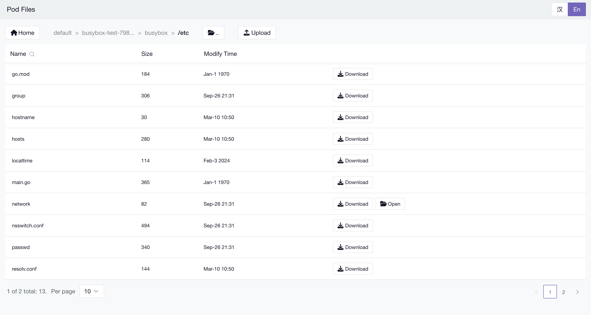

# PodFiles

PodFiles is a Go-based tool designed for managing files within Kubernetes pods. It provides a user-friendly interface to list namespaces, pods, and containers, and supports file download and upload operations between the local environment and pod containers.



## Install

There are two installation methods:

1. Deploy podfiles as a pod in the cluster using the following interactive script:

```sh
# 1. Download the deployment script
wget https://raw.githubusercontent.com/zrcoder/podFiles/main/cmd/deploy/apply.sh

# 2. Make the script executable
chmod +x apply.sh

# 3. Run the deployment script
./apply.sh

# 4. Follow the interactive prompts to configure your deployment settings.
# The script will guide you through setting the namespace, image, and so on.
```

2. Install the podfiles binary directly, which can be deployed inside or outside the cluster, but requires a kubeconfig file.

```sh
go install github.com/zrcoder/podFiles/cmd/podFiles@latest

# Assuming the kubeconfig file is ~/.kube/config
KUBECONFIG=~/.kube/config nohup podFiles > podFiles.log 2>&1 &
```

> You can use the NS_BLACK_LIST environment variable to specify namespaces to ignore.
>
> ```sh
> KUBECONFIG=~/.kube/config NS_BLACK_LIST=kube-,default nohup podFiles > podFiles.log 2>&1 &
> ```
>
> By default, it uses port 8080, but you can specify a different port using the PORT environment variable.
>
> ```sh
> KUBECONFIG=~/.kube/config PORT=8081 nohup podFiles > podFiles.log 2>&1 &
> ```
